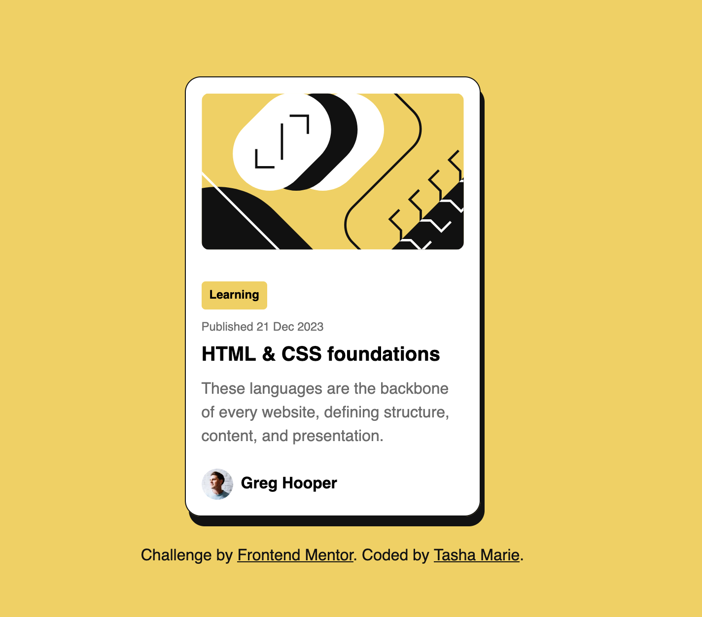

# Frontend Mentor - Blog preview card solution

This is a solution to the [Blog preview card challenge on Frontend Mentor](https://www.frontendmentor.io/challenges/blog-preview-card-ckPaj01IcS). Frontend Mentor challenges help you improve your coding skills by building realistic projects. 

## Table of contents

- [Overview](#overview)
  - [The challenge](#the-challenge)
  - [Screenshot](#screenshot)
  - [Links](#links)
- [My process](#my-process)
  - [Built with](#built-with)
  - [What I learned](#what-i-learned)
  - [Continued development](#continued-development)
  - [Useful resources](#useful-resources)
- [Author](#author)

**Note: Delete this note and update the table of contents based on what sections you keep.**

## Overview

### The challenge

Users should be able to:

- See hover and focus states for all interactive elements on the page

### Screenshot

### Links

- Solution URL: [Add solution URL here](https://github.com/tasha-marie/blog-preview-card-main)
- Live Site URL: [Add live site URL here](https://tasha-marie.github.io/blog-preview-card-main/)

### Built with

- Semantic HTML5 markup
- CSS custom properties
- Flexbox
- CSS Grid
- Mobile-first workflow

### What I learned

CSS grid was a challenge for this as I wasn't sure how to use it for a single card, but wanted the practice! 

### Continued development

Keep learning CSS grid!

### Useful resources

- [CSS Tricks](https://css-tricks.com/snippets/css/complete-guide-grid/) - This helped me understand CSS grid.

## Author

- Frontend Mentor - [@tasha-marie](https://www.frontendmentor.io/profile/tasha-marie)

